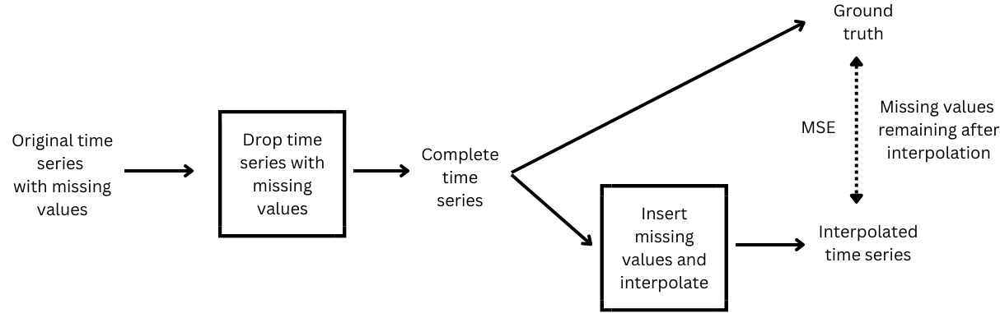
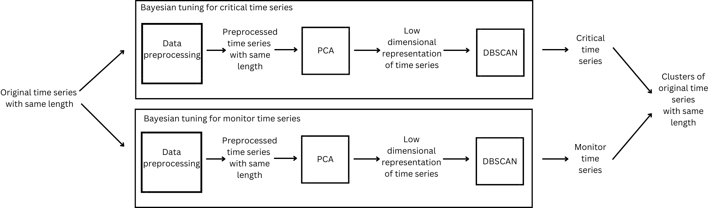

# student-mental-health
ICMLA 23 Paper: "Early Detection of Mental and Behavioral Health Issues from High-School Academic Performance"

## Tutorial

### **data_analysis.ipynb**
File used to create the time series from raw data stored in "data/grades.csv" that cannot be shown due to privacy.

WARNING: The data presented in "data/sample_grades.csv" is only a synthetic sample with limited size.

You can change the parameters at the beginning of the file to create other types of time series.

This file creates the time series that will be used in "PCA_DBSCAN.ipynb" for the analysis that will be stored in "data/ALL_COURSES_MOD_TS.csv" (already created).

The file also creates a file of the time series with missing values  stored in "data/ALL_COURSES_MOD_TS_BI.csv" (already created) that will be used for the analysis of the interpolation methods.

---

### **interpolation.ipynb**
File used to evaluate different type of interpolations.

It takes in input the file of the time series with missing values ("data/ALL_COURSES_MOD_TS_BI.csv") and create a database ("results/interpolation.db").

Each row of the database contains the combination of parameters used for interpolation, the means squared error (MSE) between the interpolated time series and the ground truth and the number time series dropped after interpolation due to remaining missing values.

At the end the interpolation method used is the one with the lowest MSE that fills all the missing values, in this way we don't have to drop other time series after interpolation.

This combination (method="linear", axis=1, order=1, limit_direction="both") is used in "data_analysis.ipynb" to perform the interpolation.

---

### **PCA_DBSCAN.ipynb**
File that contains the model called "Density-based Clustering with Feature Reduction".

It takes in input the file of the interpolated time series ("data/ALL_COURSES_MOD_TS.csv") and create 3 clusters ("critical", "monitor" and "stable") based on the probability to develop emotional issues.

In particular the dimensions of the "critical" and "monitor" cluster will be very close, but not lower, to the values specified as parameter at the beginning of the file.

You can change the parameters at the beginning of the file and run the file to start an experiment.

All the data about the experiment will be stored in "results/experiment.csv" and the plot of the clustering will be stored in "results/plots".

A few experiments are already reported in "results/experiment.csv" and in "results/plots".

---

If you have questions please feel free to reach me at davide.porello29@gmail.com
